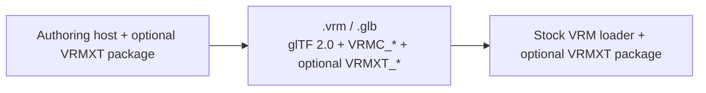

# VRMXT

Optional `VRMXT_*` glTF extensions on [VRM 1.0](https://github.com/vrm-c/vrm-specification). Same `.vrm` / `.glb` as stock `VRMC_*` data. Specs and design notes: [Extended-VRM-Specs](https://github.com/vrmxt/Extended-VRM-Specs) (drafts).

Stock VRM 1.0 without `VRMXT_*` loads in ordinary VRM tools. A file that also carries `VRMXT_*` must stay loadable when those extras are ignored. Support ships as an add-on next to the stock loader on each engine (UniVRM, Blender VRM add-on, three-vrm, …). The add-on reads and writes `VRMXT_*`; it does not replace stock VRM import/export.

`VRMXT_*` names go in `extensionsUsed`. They must not go in `extensionsRequired`. `VRMC_` stays VRM Consortium only.

Normative field rules: [specs/](https://github.com/vrmxt/Extended-VRM-Specs/tree/main/specs). Compatibility layering: [architecture](https://github.com/vrmxt/Extended-VRM-Specs/blob/main/architecture.md). Shared family rules: [VRMXT Conformance](https://github.com/vrmxt/Extended-VRM-Specs/blob/main/specs/core/vrmxt-conformance.md).

## Specs in this org

| Extension | Role |
|-----------|------|
| [`VRMXT_materials_mtoonxt`](https://github.com/vrmxt/Extended-VRM-Specs/blob/main/specs/extensions/materials/vrmxt-materials-mtoonxt/README.md) | MToonXT shader-swap markers; root [stencil](https://github.com/vrmxt/Extended-VRM-Specs/blob/main/specs/extensions/materials/vrmxt-materials-mtoonxt/stencil.md) graph |
| [`VRMXT_materials_override`](https://github.com/vrmxt/Extended-VRM-Specs/blob/main/specs/extensions/materials/vrmxt-materials-override.md) | Per-material engine override (lilToon, Poiyomi, …) |
| [`VRMXT_sprite_particle`](https://github.com/vrmxt/Extended-VRM-Specs/blob/main/specs/extensions/vfx/vrmxt-sprite-particle.md) | Portable sprite particle emitters |
| [`VRMXT_materials_face_sdf`](https://github.com/vrmxt/Extended-VRM-Specs/blob/main/specs/extensions/materials/vrmxt-materials-face-sdf.md), [`VRMXT_materials_directional_dissolve`](https://github.com/vrmxt/Extended-VRM-Specs/blob/main/specs/extensions/materials/vrmxt-materials-directional-dissolve.md) | Material extras (no shipping Apply yet) |
| [`VRMXT_springBonext`](https://github.com/vrmxt/Extended-VRM-Specs/blob/main/specs/extensions/physics/vrmxt-springbonext/README.md), [`VRMXT_springBone_override`](https://github.com/vrmxt/Extended-VRM-Specs/blob/main/specs/extensions/physics/vrmxt-spring-bone-override.md) | Spring extras / third-party solver replace |
| [`VRMXT_lattice`](https://github.com/vrmxt/Extended-VRM-Specs/blob/main/specs/extensions/deformation/vrmxt-lattice.md) | After-skin FFD cage |
| [`VRMXT_AnimationController`](https://github.com/vrmxt/Extended-VRM-Specs/blob/main/specs/extensions/animation/vrmxt-animation-controller.md), [`VRMXT_AnimationClip`](https://github.com/vrmxt/Extended-VRM-Specs/blob/main/specs/extensions/animation/vrmxt-animation-clip.md) | Root FSM + clip metadata |

Full registry, ADRs, implementation profiles, and research: [Extended-VRM-Specs README](https://github.com/vrmxt/Extended-VRM-Specs).

## Creator tutorials

Index: [tutorials/](https://github.com/vrmxt/Extended-VRM-Specs/blob/main/tutorials/README.md).

| Host | Start |
|------|--------|
| Blender | [Getting started](https://github.com/vrmxt/Extended-VRM-Specs/blob/main/tutorials/getting-started-blender.md) — [materials override](https://github.com/vrmxt/Extended-VRM-Specs/blob/main/tutorials/blender-materials-override.md), [sprite particles](https://github.com/vrmxt/Extended-VRM-Specs/blob/main/tutorials/blender-sprite-particles.md), [MToonXT stencil](https://github.com/vrmxt/Extended-VRM-Specs/blob/main/tutorials/blender-mtoonxt-stencil.md) |
| Unity | [Getting started](https://github.com/vrmxt/Extended-VRM-Specs/blob/main/tutorials/getting-started-unity.md) — [MToonXT stencil](https://github.com/vrmxt/Extended-VRM-Specs/blob/main/tutorials/unity-mtoonxt-stencil.md) |
| Warudo | [Getting started](https://github.com/vrmxt/Extended-VRM-Specs/blob/main/tutorials/getting-started-warudo.md) — [patch export](https://github.com/vrmxt/Extended-VRM-Specs/blob/main/tutorials/warudo-patch-export.md) |

Stencil examples: [parity matrix](https://github.com/vrmxt/Extended-VRM-Specs/blob/main/examples/stencil-parity-matrix.md) ([videos](https://tdw46.github.io/BVT-Stencil-Matrix/)).

## Repositories

Stock VRM 1.0 hooks (Blender third-party; UniVRM fork):

| Host | Upstream | Hooks |
|------|----------|-------|
| [VRM Add-on for Blender 4.6.0+](https://github.com/saturday06/VRM-Addon-for-Blender/releases/tag/v4.6.0) | same | [Blender Extension Hooks](https://github.com/vrmxt/Extended-VRM-Specs/blob/main/implementations/blender-extension-hooks.md) |
| [Extended-UniVRM](https://github.com/miramocha/Extended-UniVRM) | [vrm-c/UniVRM](https://github.com/vrm-c/UniVRM) | [UniVRM upstream hooks](https://github.com/vrmxt/Extended-VRM-Specs/blob/main/implementations/univrm-upstream-hooks.md) |

`VRMXT_*` packages (Warudo plugin still under [miramocha](https://github.com/miramocha)):

| Repo | Role |
|------|------|
| [Extended-VRM-Specs](https://github.com/vrmxt/Extended-VRM-Specs) | Portable file behavior |
| [three-vrmxt](https://github.com/vrmxt/three-vrmxt) | Optional npm peer for [@pixiv/three-vrm](https://github.com/pixiv/three-vrm); local-file viewer |
| [VRMXT-Extension-for-Blender](https://github.com/vrmxt/VRMXT-Extension-for-Blender) | Blender authoring / I/O via VRM1 hooks |
| [UniVRMXT](https://github.com/vrmxt/UniVRMXT) | Unity UPM on UniVRM |
| [VRMXT Plugin for Warudo](https://github.com/miramocha/VRMXT-Plugin-for-Warudo) | Warudo consumer ([Steam Workshop](https://steamcommunity.com/sharedfiles/filedetails/?id=3767350210)) |

Planned consumers (Godot, Unreal/VRM4U, desktop Player, Posing Desktop, VRChat converter) are documented in the specs repo. They are not shipping products here.

Editor capability matrix: [VRMXT Editor](https://github.com/vrmxt/Extended-VRM-Specs/blob/main/implementations/vrmxt-editor.md).
